<h1>
  Hi! I'm <a href="">Hua-Ming Huang </a>
</h1>

<li>
About me: 🇹🇼👨‍💻📖🛠️🚴🏾🏃🏾☕📷🥐🥑
</li>
  
<li>
  🕸️ <a href="">Personal Blog</a>
</li>

<li>

<a href="mailto:huaming.huang.tw@gmail.com">  
  Send e-mail to me
</a> &nbsp;
</li>

<li>

<a href="https://github.com/huaminghuangtw/huaminghuangtw/issues">
  Ask me about anything
</a> &nbsp;
</li>

<!--
TODO: link to https://github.com/DenverCoder1/readme-typing-svg

  

-->

<!--
TODO: Find a cleaner minimal-style social meida badges; Add Twitter & ORCID

  
  
  

-->

---

  <a href="https://github.com/Platane/snk">
    <picture>
      <source media="(prefers-color-scheme: dark)" srcset="https://raw.githubusercontent.com/huaminghuangtw/huaminghuangtw/snake-animation/snake-animation-dark.svg">
      <source media="(prefers-color-scheme: light)" srcset="https://raw.githubusercontent.com/huaminghuangtw/huaminghuangtw/snake-animation/snake-animation.svg">
      
    </picture>
  </a>

---

---

---

### 🌟 Highlighted Repos

---

### 📊 Fun GitHub Stats

---

<!--
TODO: Improve profile views
-->

